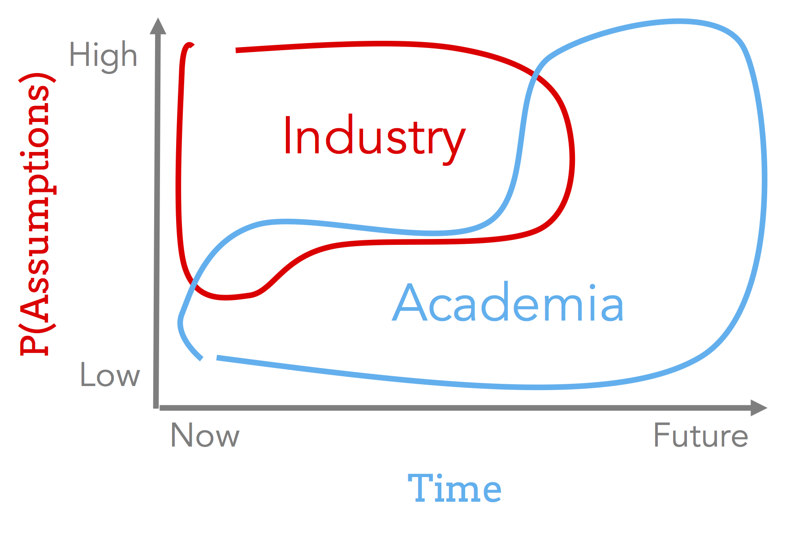

# Index

[The Model](#thesimplemodel)

* [Research as Optimization](#researchopt)

PhD Takeaways

* [PhD as Certification](#phdcert)
* [Applying for PhD](#applying)
* [Reviewing and Reading Papers](#reviewing)
  * [3 Types of Papers](#threepapers)
  * [Least Publishable Units](#lpu)

General Takeaways

* [Communication](#communication)
  * [Marketing](#marketing)
* [The Race to Publish](#race)
* [Why Research?](#whyresearch)
* [Unintended Outcomes](#badoutcomes)
* [The Assistant Professorship](#assprof)
* [Following the Crowd](#thecrowd)
* [Hammers w/out Nails](#hammer)
* [Perfection is the Enemy of Progress](#perfection)
* [Hard Problems vs Simple Problems](#hardprobs)
* [Academia vs Industry](#industry)

$$\definecolor{blue}{RGB}{18,110,213}
\newcommand{\red}[1]{\textcolor{red}{#1}}
\newcommand{\blue}[1]{\textcolor{blue}{#1}}
$$

# A "Probabilistic" Model of Research

Research is a complicated process.  It can be overwhelming because it's not clear what being a good researcher even means!
What does [doing good work](http://www.cs.virginia.edu/~robins/YouAndYourResearch.html) mean?.
There is also a lot of advice floating around -- where does this advice come from?  Is there a model from which most advice emanates?
How can one systematically reason about the process? 

Can we decompose research and view it as an optimization problem?  By doing so, can it help us systematically think about how we conduct research?  Can popular advice be viewed as partial mechanisms towards solving this optimization problem?

This document proposes _one possible_ decomposition based on probabilistic modeling, and uses it as a framing device to comment on research and ideas.
Remember that it is just one example of systematically modeling and thinking about this topic, and my hope is that it encourages you to reflect on how you can model and think about your own research.

Other than [the model](#model), the rest of the text is simply a list of examples of how the model can be used.  You can read any topic in any order.

{:.small}
Thanks to the following for their feedback on earlier versions: [sellam](sellam.me), [yifan](https://people.eecs.berkeley.edu/~yifanwu/), [marcua](http://marcua.net), [aditya](http://data-people.cs.illinois.edu), [jaan](https://jaan.io/), [gu](https://twitter.com/lydiagu), [vijay](http://www.cs.utexas.edu/~vijay/), [jmh](http://db.cs.berkeley.edu/jmh/).

If you have ideas of how to improve this document, please submit a [pull request or issue](https://github.com/researchsetup/researchsetup.github.io), or find me [on Twitter](http://www.twitter.com/sirrice).

<a class="btn twitter-share-button"
  target="_tweet"
  href="https://twitter.com/intent/tweet?text=A%20probabilistic%20model%20of%20research%20http://researchsetup.github.io/researchmodel%20by%20@sirrice"
	style="width: 10em;">
	<i></i>
  Tweet this article
</a>

### A Thinking Tool, Not a Recipe

This document is _not_ a set of step-by-step instructions of how to "succeed" at research.   Instead, it is a model for how to think about what success means, and how to judge ideas in a systematic way.  

Part of the reason research is fun is because ideas and solutions can come from anywhere.  It can come during postmortems of previous projects, thinking about what the future could be, being confused about why the world works in a weird way, by deeply studying multiple research areas and finding a connection, or more!  The is a short list of articles that describe the genesis of some ideas:

* Vijay's [CSR Tales](https://twitter.com/csr_tales) project documents the background behind research projects and is worth reading.
* Philip Guo writes [Inception: the moment when a new research project is born](http://pgbovine.net/inception.htm)
* Some discussion in marcua's [N=1 Guide to the PhD](http://marcua.net/writing/gradschool-guide/#creating-things)
* Some more discussion in the [N=2 Guide to the PhD](http://pgbovine.net/PhD-interview-eugene-wu-keith-winstein.htm)

# <a name="thesimplemodel"/>The Model 

Let's start by considering the notion of $Impact$ for a unit of research, meaning the amount that the world changes if a given unit of research is performed.    This is a deliberately vague notion, because $Impact$ is based on your own value system and what you consider important.  This could be happiness, or money, or changing how people think, or anything else.

For simplicity, let's assume a paper is the unit of research, and we would like to estimate its Impact.  To do so, let's see how it relates to impact, and break down what it takes to produce a paper (unit of research). 

#### Outcomes

We can imagine a possible outcome $o$, which could represent a product, another project, social change; its value could measure profits, social equality, happiness, etc.  Producing a paper changes how likely a given outcome will happen.  In marketing, this is called _lift_, which means how much a treatment (producing the paper) differs from the control.  In our case, we simplify the control to be not accounting for the paper at all:

$$P(o | paper) - P(o)$$

If we were to sum over all possible outcomes $\mathbb{O}$, it would represent the likely outcome value assuming the paper is successfully produced.  This is basically the expected **Outcome**, where $1$ means the best possible expected outcome, and $0$ means the worst possible:

$$\begin{align}
E[Outcome|paper] =& \sum_{o_i\in\mathbb{O}} o_i \times P(o_i | paper) - P(o_i)\\
                 =& \left(\sum_{o_i\in\mathbb{O}} o_i \times P(o_i | paper)\right) - \cancelto{0}{P(\mathbb{O})}
\end{align} $$

For the purposes of this discussion, we will ignore the control term $P(\mathbb{O})$ by setting it to $0$, but keep in mind that it embodies concepts such as related work and how industry will naturally progress.  If interested, I encourage you to further model this component and explore its implications!

#### Papers

But what does it take to produce a paper?  There are really three elements:

* **Hypothesis**: what is being claimed and what evidence does the paper assert is sufficient to prove the claim?  This is often called experimental design.   High quality design means that collecting the evidence is sufficient to prove/disprove the claim.    Low quality design means that even collecting the evidence isn't enough and there's a gap in the logic.  Let $1$ be if it is trivial to collect sufficient evidence to prove the claim (e.g., humans exist), and $0$ mean that it is pretty much impossible to prove the claim (e.g., it is possible to move faster than light).  

{:.example}
A theory paper claims that a theorem is true, and provides evidence in the form of a (correct) proof.  A systems paper claims that a new system designs can make a particular system "better" than existing designs, and provides evidence in the form of code, benchmarks, and design descriptions..  

* **Evidence**: are you, fellow researcher, capable of collecting the evidence necessary to uphold the claim?  Let $1$ mean you have the skills, the resources, and the capability to collect the evidence, and let $0$ mean that you are certainly not able to collect the evidence.

* **Assumptions**: the vast majority of claims are not universally valid, and require that some set of assumptions be true.  Let $1$ mean that the necessary assumptions hold, and $0$ means that it is not possible to satisfy the assumptions.

You can think of each of these terms as probabilities, in which case the probability that the paper is successfully produced would be:

$$P(paper) = P(hypothesis) \times P(evidence) \times P(assumptions)$$

### Putting it Together

We can now talk about the expected Impact of a paper based on the possible outcomes and the likelihood of the paper!

$$\begin{align}
E[Impact | paper] = &P(paper) \times E[Outcome | paper]\\
                  = &P(hypothesis) \times P(evidence) \times \\
                    &P(assumptions) \times E[Outcome | paper]
\end{align}
$$

If we simplify the notation, we end up with $Impact$ being composed of four parts:

$$Impact = Hypothesis\times Evidence\times Assumptions\times Outcome$$

We will use the following diagram throughout this document to illustrate concepts.  Here, each term is $1$, so the impact is $1$:

However, if any term is lower, then the inner bar will be shorter.  For instance, if the assumptions are unlikely and the experimental design (hypothesis) is shakey, then:

The specific values of each term is less important than which terms are the focus of attention, and will maximize $Impact$.

### <a name="researchopt"/>Research as Optimization

Recall that $Impact$ is computed over all possible outcomes that could be affected by the paper.  In reality, we are mere mortals, could not possibly imagine all of these outcomes, and may have optimistically imagined outcomes that actually would not come true.  Instead, we have a limited view of possible outcomes, and we can call that $\mathbb{O}_{limited}$.

We can think of all research decisions from the perspective of the following optimization problem:

Given $\mathbb{O}_{limited}$, pick the best paper $paper^*$ that  
maximizes expected impact $E[Impact | paper^*]$

This formulation can be helpful because we can borrow from existing work such as estimation theory, (non)convex optimization, probability theory, etc.  It also makes clear that we are optimizing under partial, often biased, information ($\mathbb{O}_{limited}$).

# Takeaways

There are many takeaways that we can make based studying the above optimization problem.  I group them into "things related to the PhD", and "things in general".

## PhD Takeaways

#### PhD as Certification 

The PhD is not magical.  You can think of it as certifying that you have _sufficient_ knowledge to conduct research. In other words, given $Paper$ and $Assumption$, you can design a reasonably good experiment and collect adequate evidence.  Notice they don't need to be perfect, just above some threshold.  The greyed out terms don't matter for certification.

These are the "mechanical" parts of conducting research, and is primarily about making sure that you can do things correctly.  An important purpose of taking courses, coding, doing internships, mentorship, reading papers, receiving criticism is to improve this aspect.

#### Ideas, Novelty, Vision 

Assuming you're "certified", researchers primarily differ based on  taste (e.g., what a _good outcome_ means to you).    This boils down to the quality of the ideas, and the researcher's vision.

Ideas: identifying great outcomes

* One example is to identify an exceptionally great outcome (e.g., replacing transistors) that goes beyond what is currently possible

Vision: can you anticipate the future?

* One aspect is to anticipating the future by  identifying assumptions that are currently not true ($\approx 0$), but will likely be true in the future.  Companies like Gartner try to do this for you, but as researchers at the cutting edge, perhaps you can see a bit further.
* Another aspect is the ability to consider more outcomes (a larger $\|\mathbb{O}_{limited}\|$ in our optimization problem) 

It is important to note that identifyng great outcomes, and predicting the future are difficult.  There can be a lot of uncertainty and lack of confidence in younger researchers, and it is important for the advisor and community to *nurture* these skills.

Takeaway: Excellent PhD programs/advisors nurture ideas and vision.

### Applying for a PhD 

It is clear that one hopes to admit graduate students that have the capacity to work on research that have high expected impact.  Faculty reviewers naturally seek to estimate each of the model terms from the application and interviews.   

The quantifiable ones that are easier to measure are also what the PhD certifies: $Hypothesis$ and $Evidence$.  If you have done past research or complex projects, they can be used to demonstrate _technical competence_.  This simply means it is more likely that you can learn and complete projects of interest.    This doesn't mean you need to know everything - that's the purpose of taking relevant classes, working on starter research projects, and interning.    If you assume that faculty are risk adverse, they will look for students with more samples, or samples that have high certainty described in recommendation letters.

The intangible components are related to ideas and vision.  This is part of the value of the essay.    It is harder to illustrate this unless you have led projects in the past.  If this is the case, describe the positive outcomes enabled by your work!   Show that you have vision by remarking about ways to solve our optimization problem. 

Personally, once I am convinced that an applicant is capable of learning the technical components of whatever a set of research directions might need, I soley focus on the Vision and Ideas components of the model.  These could be illustrated, but are not limited to, the following:

* $Assumptions$ that may change in the future 
* Outcomes that people are not thinking about ($\mathbb{O}_{limited}$)
* Techniques that people are not thinking of that could dramatically boost the ability to gather $Evidence$

### Reviewing and Reading Papers 

You will read and present many papers throughout your PhD.  Eventually you will have the opportunity to review papers.  The two activites overlap a lot, so I'll mainly describe this subsection in terms of paper reviewing.

Reviewing is checking that $E[Impact\|Paper]$ is high enough for the paper, with a correctness constraint.  It's important that published papers satisfy $Hypothesis\times Evidence\approx 1$.  It would be embarassing to you and the community if factually inaccurate papers slip through the cracks.    You are also checking that the assumptions actually hold ($Assumption > 0$).  These can take time but is "mechanical".

The hard part is evaluating that the paper's ideas _could_ have desirable outcomes so that its impact is above some threshold $\tau$: 

$$E[Impact|Paper] > \tau$$

The threshold $\tau$ is ill defined, but generally "higher-tier" venues have a higher threshold than lower tier venues.  Since it is ill-defined, a common reason to reject a paper is that the paper lacks "originality" or the "contribution is too small".  This can be because the $Outcomes$ are not clearly spelled out, or the connection between the paper's ideas and the outcomes are unclear ($P(o\|Paper) = ?$)

This is where it's important to stop yourself from viewing the submission from an adversarial perspective!  If you could imagine positive outcomes that fall out from the paper, _even if the authors missed them_, then the paper could be worth accepting!  Recall from above that ideas are to be nutured by the PhD process _and the research community_.

#### 3 Types of Papers 

Since the ultimate goal is to identify papers that could maximize $E[Impact\|Paper]$, let's look at how that affects different types of papers.  I'll base this on topics I am aquainted with:

<strong>Improving a well established problem</strong>, and why the experimental bar is higher:

{:.example}
 
Consider a paper that proposes a system design for a super fast key-value system.  The value of a faster system is well established, meaning there is an agreed upon set of outcomes.  It is also clear the types of evidence (xacts per second, concurrency, etc)  needed to illustrate the paper's claims.   Thus the main items to scrutinize are the techniques to establish $Evidence$ and the system's $Assumption$.  For instance, if it only works for single note transactions, or read only workloads, then it lowers the $Assumption$ term.  Since most terms are fixed, it naturally leads to emphasis on system design, assumptions, and evaluation.

<strong>The Vision(ary) paper</strong> highlights a set of outcomes so different from the rest of the research community that it's worth getting the word out because there's potential to increase $E[Impact]$ of the whole community. 

{:.example}
 
By 2011, Mechanical Turk (MTurk) had been around for about 6 years, often for labeling and data cleaning/collection tasks, and was getting attention from HCI communities.  [Adam Marcus](http://www.marcua.net) suggested that MTurk was at a price point where workers could be thought of as databases themselves.  Despite lots of work on modeling sensors, the web, remote machines, and files as databases, thinking through the implications of fleshy, human databases was pretty exciting and we wrote a ["vision paper"](http://sirrice.github.io/files/papers/qurk-cidr11.pdf) around the idea.   It sketched an architecture and slapped together a language (mediocre $Evidence$), made hand-wavy $Assumption$, but focused on the potential of great outcomes by citing existing human-intensive markets such as transcription, which was a multi-billion dollar industry.

<strong>The "Perfect" paper</strong> scores high on every term in our model.  These tend to win "test of time" awards later on, because most people can't predict how $Outcomes$ will actually play out.

{:.example}
 
Provenance is the idea of tracking the input records/objects that contributed to a result.  There were many definitions of what "contribute" means, and different ways of modeling provenance.  The [Provenance Semirings](https://www.google.com/search?q=provenance+semirings) paper introduced the notion of representing the provenance of an output record $y$ as semiring polynomials over input records. Basically, $y=x_1 + 2x_2$ means that $x_1$ and two copies of $x_2$ were used to derive the output $y$.   They showed correctness for an important subset of SQL, and showed existing notions of "contribution" were special cases.  It also presented a universe of mathematical tools to think about provenance, and immediately impacted any application that relies on provenance (e.g., auditing, derivation tracking, incremental view deletion).  
 
The paper proved correctness, so $Hypothesis=1$.  The assumptions were simply that you cared about provenance, and there was already a set of important applications that relied on provenance. It felt like the number of outcomes would only increase with time.  In effect, every term in our model was high.   
 
Other technologies such as transistors, CRISPR, and fundamental science can fall into this category. 

#### Least Publishable Units 

There is a subclass of paper widely considered as [Least Publishable](./files/lpu.pdf) [Units](https://en.m.wikipedia.org/wiki/Least_publishable_unit)  (LPUs).  These are technically correct, but not really meaningful.  In other words, some combination of the terms are so low that the impact is approximately $0$.   For instance:

* The problem is made up, so $Assumption \approx 0$
* There likely doesn't exist any positive outcomes, so $Outcome\approx 0$
<!--* The evidence is so obvious that the work was not needed, so $Evidence\approx 0$-->

My first "solo" author paper has elements of an LPU.

{:.example}
 
[Shinobi](http://sirrice.github.io/files/papers/shinobi-icde11.pdf) was a database data-layout optimization tool.  The idea is that indexes are useful for reading small amounts of data, but can slow down insert operations since the indexes need to be updated.  Instead, it would partition the data in the table and dynamically add indexes for read-heavy partitions, and drop indexes if partitions became insert heavy.  However, it only worked for geo-spatial data (e.g., checkins, car locations) and if access patterns were very predictable.  Even though it beat baselines, it was kind of slow in absolute terms.    
 
HOWEVER! It was important to write the paper as a training exercise for problem selection and developing skills so that I could collect evidence for harder problems in the future.

## General Comments 

In this section, we interpret many aspects of research in terms of maximizing $E[Impact\|Paper]$.  We assume that you have a PhD certificate, meaning $Hypothesis\times Evidence \approx 1$.

### Communication 

There is a commonly held ideal to "let the work speak for itself", meaning that good work will be recognized and appreciated.  It implicitly discourages communication if the measure of impact is fame.    But what if we care about impact in terms of changing society, policy, lives, or even other researchers' habits and tools?

That would mean that an outcome $o$ that we want is for some _other_ researcher to have greater impact by using our ideas.  For this to happen, the other researcher has to both read and understand our paper:

$$o \approx E[Impact | Other]\times P(Understands\ Paper)\times P(Reads\ Paper)$$
 
1. $P(Reads\ Paper)$.  The researcher must be aware of the work!  With [arXiV](https://arxiv.org/) and larger and larger conferences, it is difficult for any researcher to read everything.  Thus, she must be _convinced to read_ our paper.  Let's call this marketing, explored below.  
2. $P(Understands\ Paper)$.    The researcher has been convinced to read your paper!  Will it be easy for her to figure out what your paper is saying?  This is about writing clearly, thoroughly, and unambiguously, so that she can take your ideas and techniques and actually use them.  This is also why examples are important to illustrate applications of your techniques/ideas.

For related reading, see [Diffusion of Innovations](https://en.m.wikipedia.org/wiki/Diffusion_of_innovations)

#### Marketing 

Let's look into $P(Reads\ Paper)$, which is proportional to the amount of marketing.  Marketing is somewhat of sensitive issue in academia, but worth talking about.  We can break it into two terms:

$$P(Reads\ Paper) \propto Marketing = P(Awareness)\times P(Convinced)$$

1. $P(Awareness)$ can be called "Amount of Marketing".  This includes giving talks, writing blog posts, making tweets, posting videos, talking to journalists.
1. $P(Convinced)$ can be called "Quality of Marketing".  This is whether or not the quality of the marketing is good enough that prospective researcher considers it worthwhile.  In general, this term should be $\approx 1$.   This is why it can easily take a month or more to create a conference talk.

Viewing "marketing" through an optimization lens helps us think about two common types of sub-optimal strategies (since $P(Convinced)\approx1$):  

1. $Marketing\gg E[Impact]$  Overmarketing is when the amount of awareness is not consummerate with the expected impact of the work on others.  
1. $Marketing\ll E[impact]$ Arguably a more wide-spread issue is _undermarketing_, where work that could have lots of impact is not marketed enough for people to know about it.   

Both are suboptimal because it misleads others  (the first case), or deprives others from doing impactful work (the second case).  The first case is a waste of resources, but does not reduce the ultimate impact of the paper.  I think the latter case is a bigger issue because it directly reduces the impact of the paper, since people will simply not know about it.  Also, the latter is more widespread and can be ameliorated via training.  

Why are papers undermarketed?  My hypothesis is that $E[Impact\|Paper]$ is difficult to measure, and the authors are overly conservative in their estimates.  Meaning that the author's perception of their own work is lower than what it actually is.   Consider applying an estimation procedure; for instance, sampling from colleagues is a good way of compensating for your internal bias.  

### The Race to Publish

Often, it can feel like there is a race to be the first to publish before every other research group.  This makes the entire research enterprise feel like a competition, and a [zero sum](https://en.m.wikipedia.org/wiki/Zero-sum_game) game.    You could also argue that a _currently_ hot area is where there will be impact, but the model suggests that it is not the _only_ case.  

It is easy to extend our model to take into account other researchers working on the same problem.  We can assume that every term ($Hypothesis$, $Assumption$, $Outcome$) are all fixed between you and the "competing" researchers.  Thus the only term to focus on is your ability to acquire the necessary $Evidence$:

$$\begin{align}
P(Evidence) =& P(Evidence | You, Others)\\
            =& (1 - P(Evidence | Others))\times P(Evidence | You) 
\end{align}$$

This states that the evidence term depends on you and any other researcher, and that if another researcher gets the evidence before you, then your contribute to evidence drops to $0$.  Thus your contribution $P(Evidence\|You)$ needs to be weighed by the probability others can't do the work fast enough.

Given this simple model, it is clear why this is zero sum - your work reduces the impact of others' impact, and vice versa.  As a research community, it signals that there are not enough impactful directions to pursue (e.g., the community is drying up), or that it should prioritize exploratory or "visionary" work.   I'll just note that there as so many important problems in the world that this is unjustified.

### Why Research? 

Presumably, you are in a research program because you believe _doing research_ is the best way to maximize this probability:

$$E[Impact | You] \propto E[Impact | Your\ Research] + E[Impact | Your\ Nonresearch]$$

Clearly there is a strong assumption of the following, based on your desired outcomes:

$$E[Impact | Your\ Research] \gg E[Impact | Your\ Nonresearch]$$

For some people, it turns out this assumption is not true, and it is better to leave research and do non-research work.   For instance, it can be joining a non-profit, finding an arbitrage opportunity, social entrepreneurship, teaching, etc.  All of these are totally totally cool.  Remember, opportunities are endless!  

Some may try to suggest that you're not "cut out" for research, implying that $Evidence\rightarrow 0$.  Hopefully at this point you would agree that the term is independent of this larger choice. 

### Unintended Outcomes 

Since the goal is to have a positive impact on the world, it is not acceptable to simply state that one is "developing technology for technology's sake".    This is equivalent to completely ignoring the $Outcome$ or only focusing on positive outcomes.  However in reality, we would like to make sure that the positive outcomes far outweigh the negative.

This would seem obvious, but is unfortunately often not the case.  In fact, ignoring possible negative outcomes can lead to a crisis of conscience when the negative outcomes become widespread.  This is increasingly [important as tech integrates closer into our lives and society](http://www.argmin.net/2017/12/21/ascent-directions/).   This is not unique to researchers.  Recently, [facebook execs expressed their regret in eroding democracy](https://www.youtube.com/watch?v=PMotykw0SIk), while articles about silicon valley [make similar statements](https://www.buzzfeed.com/tedchiang/the-real-danger-to-civilization-isnt-ai-its-runaway?utm_term=.rmkMVmpNK#.mqWWv7ald).

The following is one that's personally scary to me:

{:.example}
The recent research in [automatically generating lipsynced videos](https://www.youtube.com/watch?v=9Yq67CjDqvw) is arguably a technology that can have deeply negative consequences.  One reason is that it makes it so easy to generate realistic-seeming videos that it fundamentally sheds doubt on what evidence can be believed.  The amount of doctored videos can be generated at a higher rate than people can discern and verify them, and [subtlely erodes discourse in a way more insidious than simply banning speech](https://www.wired.com/story/free-speech-issue-tech-turmoil-new-censorship/).

### The Assistant Professorship 

Above, I asserted that a PhD is a certificate, meaning that you are able to execute on a research problem correctly, and can hopefully mentor others to do the same.   Using the model, a narrow way to view the assistant professorship is a selection process that gives you time to show that you can select a set of papers $\mathbb{P}$ to publish such that it is above some threshold $\tau$ decided by your letter writers:

$$\left(\sum_{paper \in \mathbb{P}} E[Impact | paper]\right) > \tau$$

Check back with me in a couple years to see if this panned out.

### Following the Crowd 

Following the crowd means that the $Assumption\approx 1$.  If this is the case, it usually means that many researchers are all aware of the problems to solve, and the desirable outcomes. 

In this setting, one hopes that your ability to collect $Evidence$ far exceeds others', so that you can out-execute others.  

{:.example}
It is PhD admissions season and seemingly every applicant wants to do deep learning.  Why?  Because it's in the news (heavily marketed) and sounds exciting (the set of outcomes is perceived to be high). But if faculty are looking for candidates to help them maximize $Impact$, then how can you, as the PhD candidate, signal that you will be the maximizer? Can you show superior evidence gathering?  Or experiment design?  Or Vision and Idea generation?

### Hammers Without Nails 

It is easy to develop systems or techniques by focusing on getting $Hypothesis\times Evidence \approx 1$ (the Hammer).  This assumes that the hammer is useful for enough positive outcomes.  However, since you're on the hook looking for positive outcomes (the Nails), it runs the risk of that the intersection between what the paper can improve, and positive outcomes, is null.

Japan has a term for this: [Chindōgu](https://en.m.wikipedia.org/wiki/Chind%C5%8Dgu) (珍道具).  Wikipedia says it _"is the Japanese art of inventing ingenious everyday gadgets that seem like an ideal solution to a particular problem, but are in fact useless."_

<!--
**Imposter syndrome**

[Imposter syndrome](https://en.m.wikipedia.org/wiki/Impostor_syndrome) is a concept describing individuals who are marked by an inability to internalize their accomplishments and a persistent fear of being exposed as a "fraud".  One perspective on this is that there is an incorrect implication that

$$P(p|you)$$
-->

### Deep and Shallow Work

### Perfection is the Enemy of Progress 

It is often tempting to focus on building the perfect system, getting all possible results, fixing all the bugs, or otherwise writing the perfect paper.  This is equivalent to focusing on getting $Evidence = 1$.  Based on the model, it is clear that doing so has decreasing marginal benefit unless all other terms are so high that $E[Impact\|Paper]$ will actually increase substantially.  This seems obvious, but I see it a lot.

Learn more on the [wikipedia page](https://en.m.wikipedia.org/wiki/Perfect_is_the_enemy_of_good)

 
Notice how the impact term basically did not change even as $Evidence\rightarrow 1$.  However improving the Assumptions to the same level as the Evidence dramatically improves Impact.  It's simple multiplication.

The desire for perfection can creep up in many ways:

* Not releasing a project because it is not good neough
* Seeking to survey all possible related work before starting
* Editing and re-editing a paper because its writing style is not perfect
* Working on areas where the $Assumptions$ are well established and the $Outcomes$ are nearly as good as they could get: forever polishing a round ball.

A final note: avoiding perfection should not be viewed as discouraging you to strive towards excellence.    The former is with respect to an external _goal_ such as a project or paper, whereas the latter is a life-long process of self improvement.

### Hard Problems vs Simple Problems 

Grad students often worry about not working on "hard problems" because solving hard problems is viewed as a badge of honor, and shows that you're [smart](https://www.youtube.com/watch?v=tcGQpjCztgA).  A hard problem is a paper where the evidence is basically impossible to get.  Solving it supposedly implies that you can solve other hard problems.

Hopefully by this point, it is obvious why problem hardness does not necessarily correlate with high impact, since it says nothing about the other terms (unless the desired outcome is to appear smart).  This is why working on simple problems is actually great, as long as it is carefully selected to maximize impact!

### Academia vs Industry 

Finally, a comment about doing research in academia vs industry.  Arguably, industry has far more resources than academics, so academics should be selective about the class of papers to work on.  In other words, we can assume that for the most part, $P(Evidence\|Industry)\gg P(Evidence\|You)$, however industry has pressure to show short-term results.  Thus, the ideal class of problems are ones where $P(Assumption \| Now) \approx 0$ and $P(Assumption\|Future) \approx 1$.  Here's a made up diagram illustrating the point:

# Closing Thoughts

This document argues for modeling the process of research as an optimization problem, and discussed how it can serve as a framework to critically view different facets of the research enterprise.
It proposed one possible, and [imperfect](#perfection), model to use as a running example.
In my opinion, the most valuable takeaway is the decomposition process from research goals to probabilistic terms,  and viewing this through an optimization lens.

If you have ideas of how to improve this document, please submit a [pull request or issue](https://github.com/researchsetup/researchsetup.github.io), or find me [on Twitter](http://www.twitter.com/sirrice).

<a class="btn twitter-share-button"
  target="_tweet"
  href="https://twitter.com/intent/tweet?text=A%20probabilistic%20model%20of%20research%20http://researchsetup.github.io/researchmodel%20by%20@sirrice"
	style="width: 10em;">
	<i></i>
  Tweet this article
</a>

<!--
# <a name="appendix"/>Appendix 

The appendix describes how we originally decomposed $Impact$ into the model described in the body of this document.    

### The Model

For simplicity, we assume a paper as the unit of research and build a model of the expected positive impact $E[impact\|p]$ of a paper $p$.  

Consider all possible outcomes $\mathbb{O}$, where $o\in\mathbb{O}$ is _some_ goodness value for a possible future $o$.  For example, $o$ could represent a product, another project, social change; its value could measure profits, social equality, happiness, etc. Let $\mathbb{O}_p\subseteq \mathbb{O}$ be the subset of outcomes that are affected by the paper.   We could add up all possible outcomes weighed by how probable they are if the paper is written:

$$E[impact | p] =  P(p | you) \sum_{o \in \mathbb{O}_p} o\times P(o | p)$$

$P(p)$ is the probability that the paper's claims actually hold.   This hinges on  your ability to collect evidence $evid$ to support the claims and the paper's assumptions $assum$ being true:  

$$P(p) \approx P(p | evid, assum) P(evid | you) P(assum)$$

To summarize, the impact of a paper is:

$$E[impact | p] = 
\blue{P(p | evid, assum) P(evid | you)} 
\red{P(assum)}
\red{\sum_{o \in \mathbb{O}_p} o\times P(o | p)}
$$

**Correctness: is the paper believable?**

$\blue{P(p \| evid, assum)}$ defines whether the evidence is good enough to prove the claim.  This is called experimental design and it should be 1.

$\blue{P(evid \| you)}$ is called _conducting research_ and should be close to 1.  

**Impact: does the paper matter?**

$\red{P(assum)}$ defines the scope of the applicability.  Understanding the market, trends, talking to practitioners increases the probability of picking a problem where the assumptions hold.

$\red{o\times P(o \| p)}$ defines the belief about whether or not the outcome $\red{o}$ is meaningful and how much the paper will increase its likelihood $\red{P(o \| p)}$.   

### Research as Optimization 

Of course, you  only have a limited view of the possible outcomes $\mathbb{O}_r$, where in this case $r=you$. It is very likely that you cannot imagine all but a small number of the possible outcomes, and some that you imagine may also be wrong:

$$\begin{align}
|\mathbb{O}_{r}| &\ll |\mathbb{O}_p|\\
\mathbb{O}_{r} &\not\subseteq \mathbb{O}_p
\end{align}$$

The optimization problem is simple to state:

Given $\mathbb{O}_{r}$, pick the best paper $p^*$ that maximizes $E[impact|p^*]$   
 
s.t. $\nexists p'\ E[impact|p'] \gg E[impact|p^*]$

The _Novelty_ constraint says that $p^*$ is better than any alternative $p'$ in related work.  Also, note that the input is $\mathbb{O}_{r}$ but $E[\circ]$ is defined over $$\mathbb{O}_{p^*}$$.

-->
